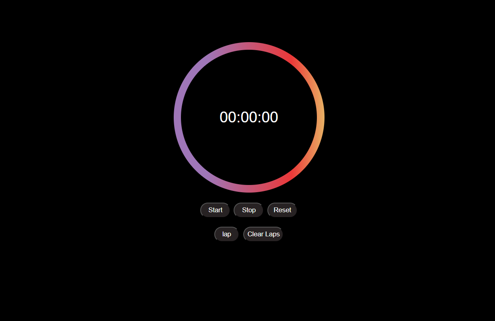

# Stopwatch Web App

A simple and stylish stopwatch web application built with HTML, CSS, and JavaScript.  
Features start, stop, reset, lap, and clear lap functionalities, with a modern circular design and responsive layout.

## Features

- **Start/Stop/Reset:** Control the timer easily.
- **Lap:** Record lap times.
- **Clear Laps:** Remove all lap records.
- **Responsive Design:** Works well on desktop and mobile devices.
- **Modern UI:** Gradient circles and clean button layout.

## Usage

1. **Clone or download** this repository.
2. Open `watch.html` in your browser.

## File Structure

- `watch.html` — Main HTML file for the stopwatch UI.
- `watch.css` — Styles for layout, circles, buttons, and lap list.
- `watch.js` — Stopwatch logic and event handlers.

## How It Works

- Click **Start** to begin timing.
- Click **Stop** to pause.
- Click **Reset** to set the timer back to 00:00:00.
- Click **Lap** to record the current time in the lap list.
- Click **Clear Laps** to remove all lap records.

## Screenshots

  

**Made by [sravan_venkata]**